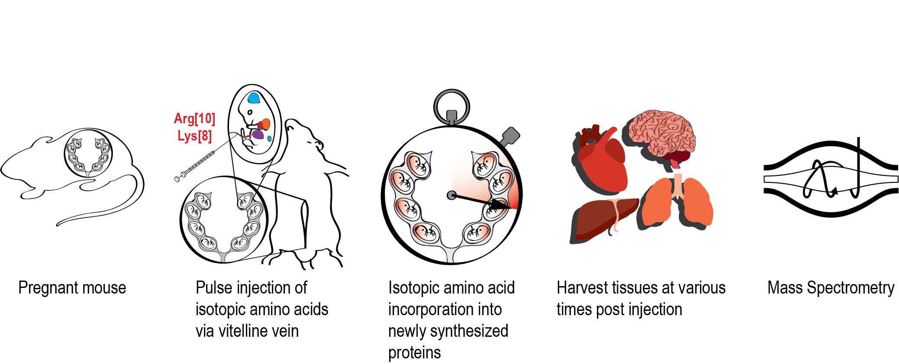

<!-- README.md is generated from README.Rmd. Please edit that file -->

# quantifying *in utero* protein turnover

<!-- badges: start -->
<!-- badges: end -->

This repository contains the code used to make the figures found in the
*in utero* turnover manuscript by Baeza *et. al.*

